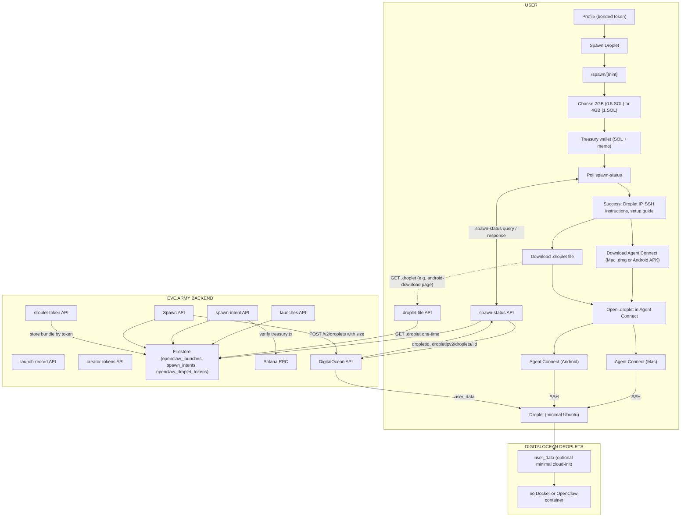

# OpenClaw Spawn Droplet + Agent Connect Architecture

Full stack: bonded token → Spawn Droplet → pay SOL → minimal Ubuntu droplet → download Agent Connect (Mac or Android) and .droplet file → open in Agent Connect → SSH to droplet.

Style matches the original [OpenClaw Spawn Droplet Architecture](SPAWN_DROPLET_ARCHITECTURE.md) (USER / EVE.ARMY BACKEND / DIGITALOCEAN DROPLETS swimlanes), extended with **Agent Connect (Mac and Android)** and the **droplet-token** / **droplet-file** APIs for .droplet delivery.

Rendered diagram (dark background, swimlane style): [`public/images/spawn-droplet-agent-connect-architecture.png`](../public/images/spawn-droplet-agent-connect-architecture.png).

## Diagram (Mermaid)

Render with a dark theme to match the original diagram style (e.g. Mermaid live editor with `theme: dark` or export to PNG).

## Summary

| Layer | Components |
|-------|------------|
| **USER** | Profile → Spawn Droplet → /spawn/[mint] → choose 2GB/4GB → pay SOL (treasury) → poll spawn-status → **Success** (Droplet IP, SSH instructions, setup guide). Then **Download Agent Connect** (Mac .dmg from releases/latest or GitHub; Android APK from GitHub or android-download page) and **Download .droplet file** (blob on spawn page, or direct link on android-download page via droplet-file API). **Open .droplet in Agent Connect** → **Agent Connect (Mac)** or **Agent Connect (Android)** → **SSH** to Droplet. |
| **BACKEND** | Same as spawn-only (spawn-intent, Spawn API, spawn-status, Firestore, Solana RPC, DigitalOcean API). Plus **droplet-token API** (POST: store .droplet bundle by one-time token for android-download flow) and **droplet-file API** (GET: return .droplet file by token, one-time). |
| **DIGITALOCEAN** | Droplet (minimal Ubuntu, user_data cloud-init). **SSH** target for Agent Connect Mac and Agent Connect Android (terminal session for OpenClaw setup). |

## Agent Connect apps

- **Agent Connect (Mac):** Desktop app (.dmg). User downloads from `/agent-connect/releases/latest` (redirects to GitHub or env URL), or from spawn page link. Opens .droplet file → connects via SSH to droplet.
- **Agent Connect (Android):** Android app (.apk). User downloads from GitHub Releases (or env URL). On mobile wallet (e.g. Backpack), user can tap "Download for Android (APK + .droplet)" on spawn page → backend creates one-time token (droplet-token API) → opens android-download page in browser → user taps "Download .droplet file" (droplet-file API) and "Download Agent Connect (Android APK)". Both apps use the .droplet file (host, port, user, private key) to establish SSH to the droplet.
