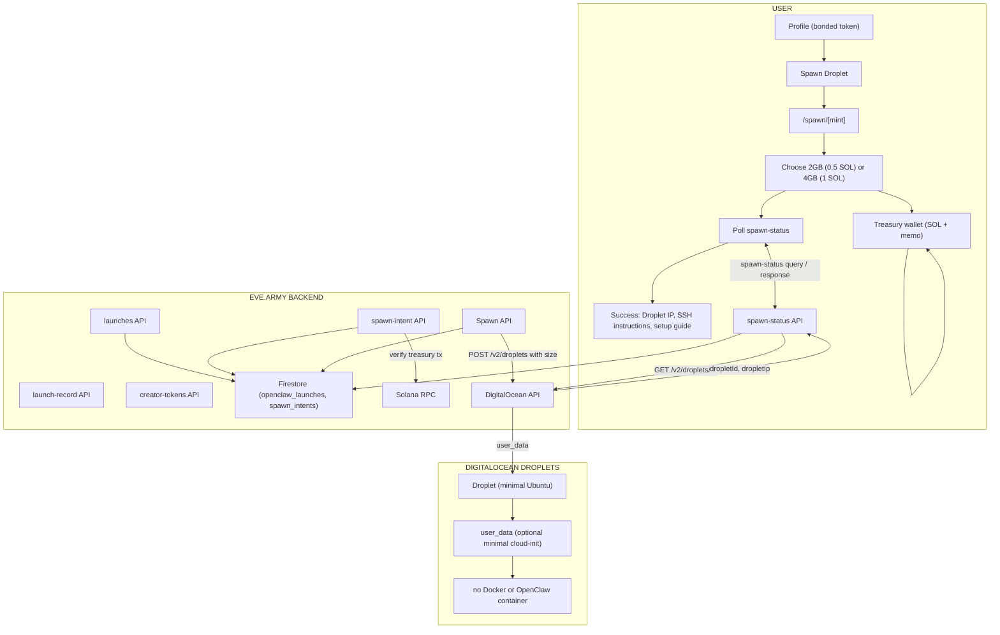

# OpenClaw Spawn Droplet Architecture

High-level flow: bonded token → Spawn Droplet → choose size (2GB / 4GB) → pay SOL → minimal Ubuntu droplet → SSH + setup guide (no agent URL).

Rendered diagram (matching Hatch Architecture style): [`public/images/spawn-droplet-architecture.png`](../public/images/spawn-droplet-architecture.png).

## Summary

| Layer | Components |
|-------|-------------|
| **USER** | Profile → Spawn Droplet → /spawn/[mint] → choose 2GB/4GB → pay SOL (spawn-intent) → poll spawn-status → success shows **Droplet IP**, **SSH instructions**, **OpenClaw setup guide**. No agent URL link. |
| **BACKEND** | spawn-intent API (create intent by size, verify tx); Spawn API (create minimal droplet with size); spawn-status API (return dropletIp); Firestore (spawn_intents, deployDropletId, dropletIp). |
| **DIGITALOCEAN** | Droplet created with chosen size (s-1vcpu-2gb or s-2vcpu-4gb). Minimal Ubuntu; no OpenClaw container, no gateway token. User SSHs in and installs OpenClaw per guide. |
